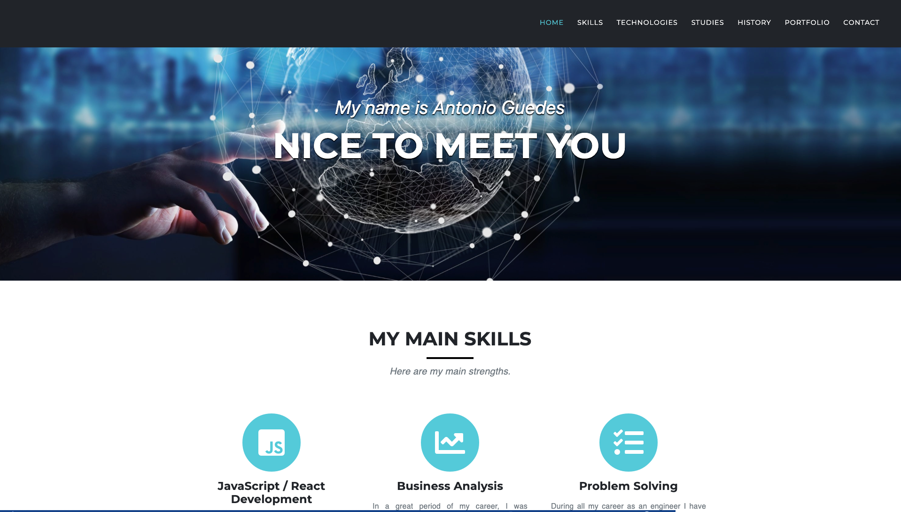

# Responsive-Portfolio

  ## Description
  A portfolio webpage that run in the browser and feature dynamically updated HTML and CSS using JavaScript (jQuery). 
  
  ## Table of contents
  
  * [Installation](#installation)
  * [Usage](#usage)
  * [License](#license)
  * [Contributing](#contributing)
  * [Questions](#questions)
  

  ## Installation
  
  This app is hosted on heroku. You can access the app by clicking [here](http://www.guedesantonio.com).

  ## Usage
  
  The website has a navbar where you can click to scroll directly to the desired area. Under the Portfolio section you can click on the projects image to see a brief description.
  Also at the end is possible to messages inputing your information on the input fields.

  

  ## License
  This project is licensed under the MIT.

  ## Contributing
  See [Questions](#Questions) section.

  ## Questions
  If you have any questions about the repo, open an issue or contact me directly at gguedesantonio@gmail.com. 
  You can find more about my work at [Github profile](https://github.com/guedesantonio). 
